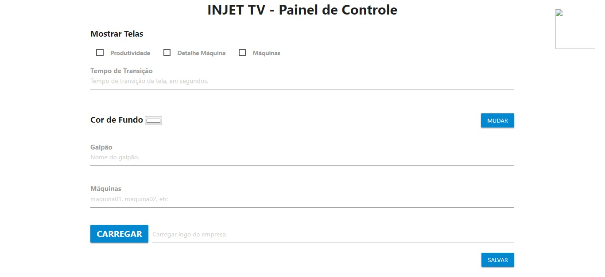

# Injettv (telas)

## Painel

Tela que exibe campos e opções que recebem dados concernentes a configuração da tela de produtividade.

- __Mostrar Telas__ oferece três opções de tela, cada uma com um propósito peculiar;
- __Tempo de Transição__ espera receber um valor numérico que corresponde ao tempo de alternância para atualizar os dados na tela;
- __Cor de Fundo__ permite que uma cor seja selecionada e altera a cor da tela ao clicar no botão *aplicar*;
- __Galpão__ recebe o nome de um galpão;
- __Máquinas__ recebe o nome de uma ou mais máquinas digitadas pelo usuário. *Ex.: maquina01, maquina02, etc*;

- Por fim, existe o campo para carregar uma imagem (um logo) que será exibido no canto superior direito da tela;

- Botão __Enviar__ ao ser clicado vai para a tela selecionada acima.

## Produtividade

Exibe alguns dados relativos as máquinas existentes no galpão dado pelo usuário no *painel* - tela que antecede esta.

Cada máquina possui legendas que descrevem o seu estado atual, o nome da máquina, descrição da máquina e o OEE. 