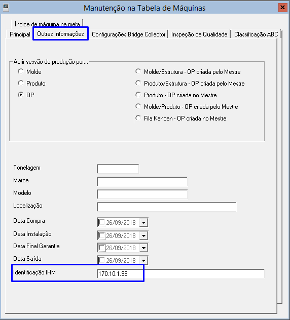
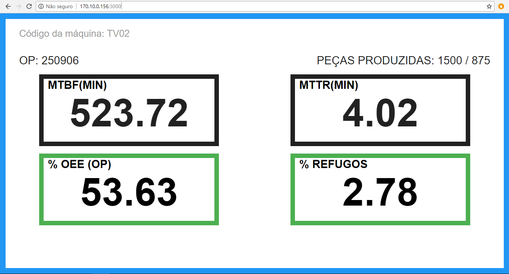
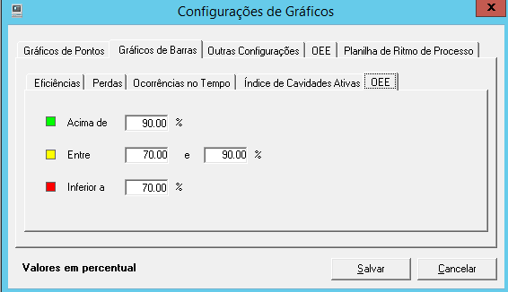
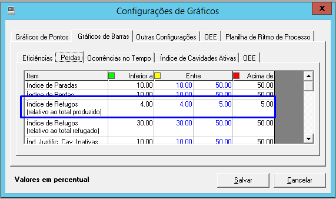
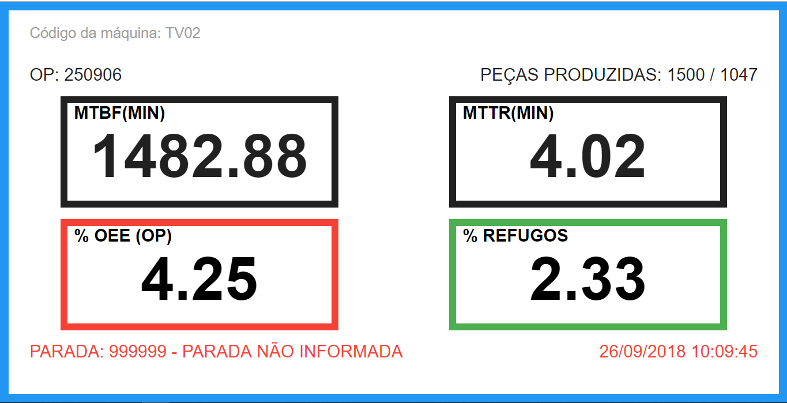

**SISTEMA INJET**

**DESCRITIVO INJET WEB TV v.122**

**MANAUS - AM**

**2018**

Sumário
=======

[1. APRESENTAÇÃO 3](#apresentação)

[2. CONFIGURAÇÕES TÉCNICAS 3](#configurações-técnicas)

[3. CADASTRO DE MÁQUINA 3](#cadastro-de-máquina)

[4. ACESSAR SISTEMA INJET WEB TV 4](#acessar-sistema-injet-web-tv)

 1. APRESENTAÇÃO
===================

O Sistema Injet WEB TV possui a funcionalidade de acompanhamento em tempo real
dos indicadores: OP, Peças Planejadas e Produzidas, Tempo de MTBF e MTTR, OEE,
Índice de Refugo, Paradas/Alertas aberto de determinada máquina online, onde
poderão ser visualizados em TV’s do tipo SmartTV – com rede WI-FI e WEB- browser
capaz de interpretar HTML/JS.

2. CONFIGURAÇÕES TÉCNICAS
=========================

-   É necessário que o serviço (servidor de aplicação) Node seja instalado e
    habilitado no computador servidor com acesso ao sistema IDW (Tomcat idw),
    conforme descrito no arquivo README.md que se encontra na pasta da aplicação
    [injetsmarttvweb]. Esse serviço é o que responderá a cada link web da
    SmartTV;

-   No web.xml IDWAtivo deverá estar falso

\<context-param\>

\<param-name\>IDWAtivo\</param-name\>

\<param-value\>false\</param-value\>

\</context-param\>

-   Scripts específicos do Injet, IDW/VF seja rodado no BD;

Para maiores informações do pacote e instalações consultar o Suporte Map.

3. CADASTRO DE MÁQUINA
======================

No InjetCad, cadastro de máquinas, na aba outras informações, foi criado um novo
campo: Identificação IHM.

Este campo deve ser preenchido com o IP do SmartTV.

Figura 1

**Obs:** Outras máquinas poderão ter o mesmo IP TV no campo Identificação IHM.

4. ACESSAR SISTEMA INJET WEB TV
===============================

No SmartTV acessar browser da TV e chamar layout pelo endereço:
<http://IpdoServidortomcat:porta> ou <http://IpdoServidor:Porta/?segundos=20> e
clicar Enter/OK.

Página exibe a tela abaixo:

Figura 2

Nessa tela serão exibidos o Código de Máquina, Peças Planejadas e Produzidas,
Tempo acumulado de MTBF e MTTR, Índice de OEE (OP), Índice de Refugo (OP) e
Paradas/Alertas se estiver aberto.

-   Exibe o Código da Máquina que está com IP cadastrado no Injet (Em caso de
    ter mais de uma máquina com o mesmo IP da TV, será exibido a primeira na
    ordem que está no cadastro do Injet).

-   Número da OP atual;

-   Peças Produzidas: Quantidade Planejada / Quantidade líquida (bruta –
    refugo). Quantidade Produzida relativa à OP e máquina específica.

-   Os campos de "MTBF" e "MTTR" exibirão dados dos últimos 180 dias, a amostra
    de 180 dias é independente de OP que está em máquina no momento, ou seja, é
    uma amostra de todas as OPs que passaram em máquina nos últimos 180 dias
    (máquina específica mostrada).

-   O Índice de OEE e Refugos exibirão dados da OP atual.

-   O Índice de OEE e Refugos exibirão a borda em cores (vermelho, amarelo e
    verde) conforme padrão Injet.

-   Caso OP seja finalizado, layout exibirá todos os campos em branco;

A definição das cores das bordas do % OEE é baseado nos parâmetros indicado na
rotina das configurações internas do sistema localizado em : InjetGer \>\>
Utilitários \>\> Funções internas do sistema \>\> configurações de gráficos \>\>
Gráfico de barras \>\> OEE

Figura 3

A definição das cores das bordas do % Refugo é baseado nos parâmetros indicado
na rotina das configurações internas do sistema localizado em : InjetGer \>\>
Utilitários \>\> Funções internas do sistema \>\> configurações de gráficos \>\>
Gráfico de barras \>\> Perdas \>\> Índice de Refugos (relativo ao total
produzido).

Figura 4

Serão exibidos códigos de Parada ou Alerta em Aberto com o dia e hora em que foi
aberto (somente em aberto). **OBS:** Em caso de ocorrer simultaneamente parada e
alerta em aberto, a prioridade de exibição será **ALERTA**.

Figura 5

O intervalo de exibição (*refresh*) está automático em 15seg. **OBS:** se o
usuário desejar alterar o tempo de atualização basta chamar pelo link:
<http://IpDoServidor:Porta/?cdpt=CódigodeMáquina&segundos=20>

Considera-se uso da resolução 1080p (1920x1080) 16:9.

Para chamar na TV outra máquina que não está com o IP SmartTV cadastrado no
injet, será necessário utilizar o link:
<http://IpDoServidor:Porta/?cdpt=CódigoDeMáquinaDesejado>

SERVIÇO DE ATENDIMENTO AO CLIENTE

Departamento Técnico

<suporte01@maptechnology.com.br>

Departamento Comercial

*comercial\@maptechnology.com.br*

Fone/Fax:

1.  3613 - 1474

2.  3613 - 2001

Rua Pedrarias de Avilar, 129, Japiim

CEP 69077 – 450 – Manaus – AM

\* Horário de funcionamento: De segunda à sexta, das 8 às 18h.
